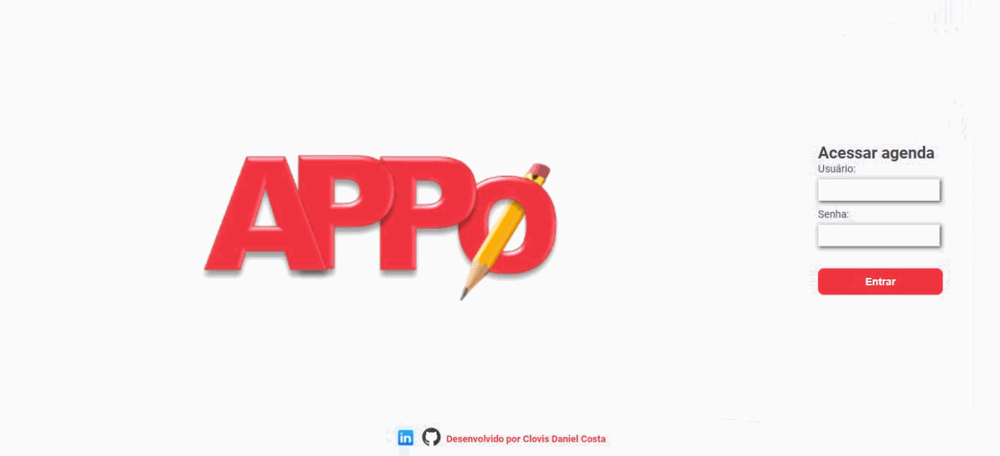

<h1 align="center">
:small_red_triangle_down:  Agenda de Compromissos
</h1>
<h2 align="center">
Curso Python e Django - Desenvolvimento Web e Banco de Dados
</h3>
<h3 align="center">
Bootcamp Global FullStack Developer da Digital Innovation One
</h3>

  

  

O objetivo deste projeto é reproduzir uma agenda customizada a partir do modelo apresentado no curso de Introdução ao Python e Django - Desenvolvimento Web e Banco de Dados da <b>Digital Innovation One<b> aplicando alguns conceitos aprendidos no cursos de HTML5 e CSS3.

  <a href="#cloud-deploy">Deploy</a>&nbsp;&nbsp;&nbsp;|&nbsp;&nbsp;&nbsp;
  <a href="#rocket-tecnologias">Tecnologias</a>&nbsp;&nbsp;&nbsp;|&nbsp;&nbsp;&nbsp;
  <a href="#computer-instalando">Instalando</a>&nbsp;&nbsp;&nbsp;|&nbsp;&nbsp;&nbsp;
  <a href="#books-aprendendo">Aprendendo</a>&nbsp;&nbsp;&nbsp;|&nbsp;&nbsp;&nbsp;
  <a href="#small_orange_diamond-contribuindo">Contribuindo</a>&nbsp;&nbsp;&nbsp;|&nbsp;&nbsp;&nbsp;
  <a href="#small_orange_diamond-customizando">Customizando</a>&nbsp;&nbsp;&nbsp;|&nbsp;&nbsp;&nbsp;
  <a href="#small_orange_diamond-licença">Licença</a>

  

## :cloud: Deploy

Foi usado o servidor Heroku para o deploy e pipeline de integração contínua da aplicação. Para testar a aplicação use o usuário "convidado" e senha "user12345" no link abaixo:

[https://python-agenda.herokuapp.com/](https://python-agenda.herokuapp.com/)

## :rocket: Tecnologias

Nesse projeto foram usadas as seguintes tecnologias:

- [Python](https://www.python.org/)
- [Django](https://www.djangoproject.com/)
- [Postgres](https://www.postgresql.org/)
- [Html5](https://developer.mozilla.org/pt-BR/docs/Web/HTML/HTML5)
- [Css3](http://www.linhadecodigo.com.br/artigo/3566/introducao-as-novidades-do-css3.aspx)
- [Sqlalchemy](https://www.sqlalchemy.org/)
- [Flask](https://flask.palletsprojects.com/en/1.1.x/)

## :computer: Instalando

1. É requisito necessário ter instalados na máquina Python, Django e Postgres.

2. Faça o clone deste repositório numa pasta desejada:  

  `$ git clone -b localhost https://github.com/clovisdanielcosta/python-agenda.git`

 3. Entre na pasta do app:
  `$ cd python-agenda`

4. Rode este comando para instalar as dependências:
  `$ pip install -r requirements.txt`

5. Rode este comando para subir o servidor:
  `$ python manage.py runserver`

6. Na barra de endereço de um navegador digite:
  `$ localhost:8000`

## :books: Aprendendo

## :small_orange_diamond: Contribuindo

## :small_orange_diamond: Customizando

## :small_orange_diamond: Agradecimentos

Quero agradecer a <b>Digital Innovation One</b> e parabenizar o Rafael Galleani pelo excelente ensino durante as aulas. 
Parabéns pelo trabalho de vocês. 

Muito obrigado!:clap::clap:

